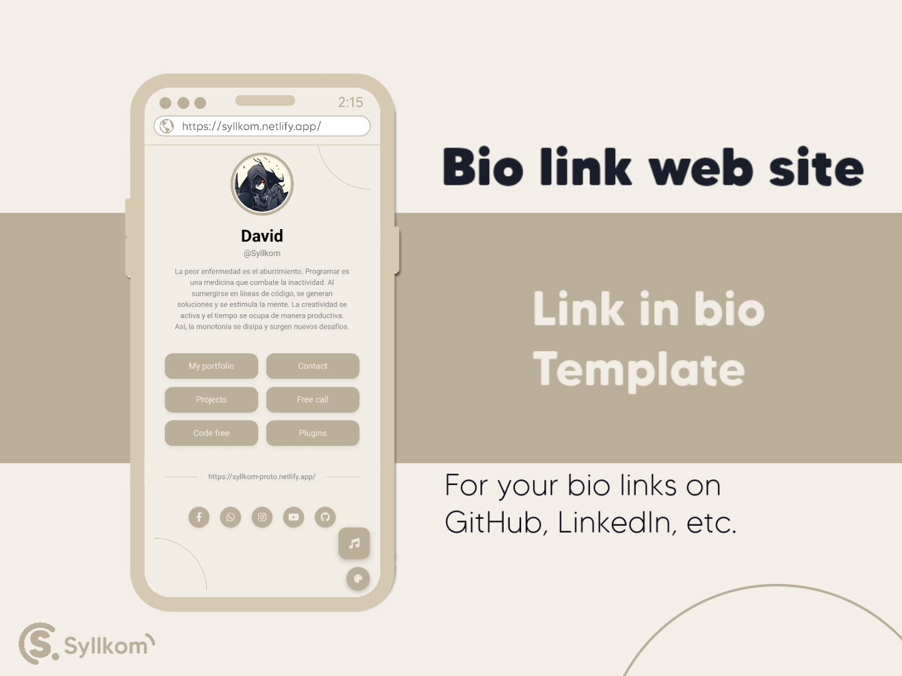

# Bio Link Web - Frontend



Un **bio link web** elegante, práctico y 100% configurable desde el código. Ideal para compartir tus enlaces más importantes en un solo lugar.

## ☲ Características

- ☄ **Fácil de usar**: todo está preconfigurado en el archivo `script.js`. Solo modifica unas cuantas líneas para personalizar nombre, enlaces, redes y más.
- ⛬ **Temas personalizables**: incluye temas claros como *default*, *oscuro* y *gris*.
- ⚂ **Plugins estilo web**: si no te gusta el selector de colores, simplemente elimina el archivo `settings.js` del HTML. ¡Plug-and-play total!
- ▶ **Soporte para música** con el reproductor incluido (`player.js`).
- ▢ **Responsive** y optimizado para móviles.
- ✦ **Diseñado para mentes creativas**: el código está pensado para ser fácilmente entendible y modificable.

## ✱ Personalización rápida

1. Abre `script.js` y modifica el objeto `all` para cambiar tu nombre, nickname, imagen y sitio web.
2. Cambia los enlaces sociales en el objeto `mediaLinks`.
3. Personaliza los botones en el objeto `actionLinks`.

## ⛬ Temas

- Default
- Dark
- Grey

Puedes cambiar de tema con el botón flotante de paleta de colores. Si no deseas esa funcionalidad, **elimina esta línea** del `index.html`:

```html
<script src="./assets/script/settings.js"></script>
```

## ⛉ Importante

**Si utilizas este código como base para tus proyectos, por favor recuerda dar crédito:**

```html
<!-- 
  Basado en Syllkom
  GitHub: https://github.com/Syllkom/Syllkom-bio
-->
```

---

<div align="center">
  
  ### Desarrollado por [Syllkom](https://github.com/Syllkom)
  
  [](https://github.com/Syllkom)
  
  © 2025 Syllkom. All rights reserved.
